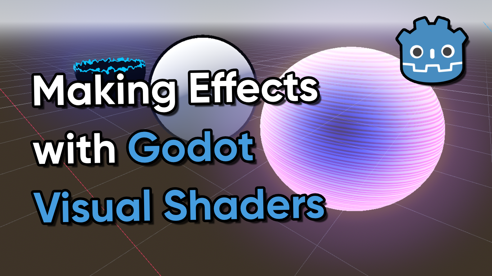

# Godot VisualShaders Collection

A repository for Godot versions of some of my shaders.

## Overview

This project contains a few shaders made using Godot. The intention is to use these shaders as a learning tool, so it (hopefully) covers the extent of Godot's shader capabilities, or will do in the future.

## Software

This project was created using Godot 4.2.1.

## Tutorials

This project is also part of a tutorial series which can be found in the following places:

- [Making Effects with Godot Visual Shaders (YouTube)](https://www.youtube.com/watch?v=S1FPSU1sp5E)
- [Making Effects with Godot Visual Shaders (Article)](https://danielilett.com/2024-02-06-tut8-1-godot-shader-intro/)

## Authors

This project and the corresponding tutorials were created by Daniel Ilett.

## Release

The first public release of this project was on February 6th 2024.
